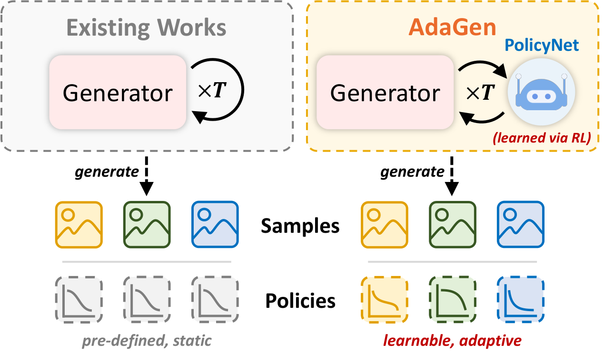

<div align="center">

# AdaGen

**Learning Adaptive Policy for Image Synthesis**

<p align="center">
    <a href="https://nzl-thu.github.io/">Zanlin Ni</a> &emsp;
    <a href="https://wyl.cool/">Yulin Wang</a> &emsp;
    Yeguo Hua &emsp;
    <a href="https://zrp21.notion.site/">Renping Zhou</a> &emsp;
    <a href="https://www.jiayiguo.net/">Jiayi Guo</a> &emsp;
    Jun Song &emsp;
    Bo Zheng &emsp;
    <a href="https://gaohuang-net.github.io/">Gao Huang<sup>✉</sup></a>
</p>

<p align="center">
    Tsinghua University &emsp; Alibaba Group
</p>

[](https://arxiv.org/abs/XXXX.XXXXX)
[](LICENSE)

</div>

## Overview

<div align="center">
  
</div>

Existing multi-step generative models (MaskGIT, DiT, SiT, VAR, Stable Diffusion, etc.) rely on **pre-defined, static schedules** to configure generation policy (e.g., noise level, masking ratio, sampling temperature) uniformly across all samples.

**AdaGen** leverages reinforcement learning to train a lightweight policy network that **learns sample-adaptive generation policies** — dynamically adjusting each hyperparameter at every step based on the current generation state.

Key results:
- **AdaGen-DiT-XL**: FID 2.19 in **16 steps** (4.1 TFLOPs) vs. baseline DiT-XL FID 2.29 in **50 steps** (12.2 TFLOPs) — ~**3× inference cost reduction**
- **AdaGen-VAR-d30**: FID **1.59** vs. baseline **1.92**
- Works universally across MaskGIT, diffusion, autoregressive paradigms.

## News

- **2026-03-08**: Released evaluation code and checkpoints for MaskGIT, DiT, SiT, and VAR.

## Installation

```bash
git clone https://github.com/LeapLabTHU/AdaGen.git
cd AdaGen
pip install torch torchvision accelerate einops loguru tqdm numpy pyyaml torch_fidelity torchdiffeq
```

## Assets

Download all checkpoints and place them under `assets/` following this layout:

```
assets/
├── backbones/
│   ├── MaskGIT-L.pth
│   ├── DiT-XL-2-256x256.pt
│   ├── SiT-XL-2-256.pt
│   ├── var_d16.pth
│   └── var_d30.pth
├── policies/
│   ├── maskgit_policy.pth
│   ├── dit_policy.pth
│   ├── sit_policy.pth
│   ├── var_d16_policy.pth
│   └── var_d30_policy.pth
├── autoencoder_kl_ema.pth
├── vae_ch160v4096z32.pth
├── vqgan_jax_strongaug.ckpt
├── pt_inception-2015-12-05-6726825d.pth
└── fid_stats/
    └── fid_stats_imagenet256_guided_diffusion.npz
```

### Backbone & Policy Checkpoints

FID-50K is measured on class-conditional ImageNet 256×256 with AdaGen policy applied.

| Model | Backbone | Policy | FID-50K |
|:------|:---------|:-------|--------:|
| MaskGIT-L | [MaskGIT-L.pth](https://huggingface.co/nzl-thu/MaskGIT-L/resolve/main/MaskGIT-L.pth) | [maskgit_policy.pth](https://huggingface.co/nzl-thu/AdaGen_Policies/resolve/main/maskgit_policy.pth) | 2.41 |
| DiT-XL/2 | [DiT-XL-2-256x256.pt](https://dl.fbaipublicfiles.com/DiT/models/DiT-XL-2-256x256.pt) | [dit_policy.pth](https://huggingface.co/nzl-thu/AdaGen_Policies/resolve/main/dit_policy.pth) | 2.19 |
| SiT-XL/2 | [SiT-XL-2-256.pt](https://www.dl.dropboxusercontent.com/scl/fi/as9oeomcbub47de5g4be0/SiT-XL-2-256.pt?rlkey=uxzxmpicu46coq3msb17b9ofa&dl=0) | [sit_policy.pth](https://huggingface.co/nzl-thu/AdaGen_Policies/resolve/main/sit_policy.pth) | 2.12 |
| VAR-d16 | [var_d16.pth](https://huggingface.co/FoundationVision/var/resolve/main/var_d16.pth) | [var_d16_policy.pth](https://huggingface.co/nzl-thu/AdaGen_Policies/resolve/main/var_d16_policy.pth) | 2.62 |
| VAR-d30 | [var_d30.pth](https://huggingface.co/FoundationVision/var/resolve/main/var_d30.pth) | [var_d30_policy.pth](https://huggingface.co/nzl-thu/AdaGen_Policies/resolve/main/var_d30_policy.pth) | 1.59 |

### Additional Evaluation Assets

| File | Download |
|:-----|:---------|
| `autoencoder_kl_ema.pth` | [Download](https://drive.google.com/file/d/10nbEiFd4YCHlzfTkJjZf45YcSMCN34m6/view) |
| `vae_ch160v4096z32.pth` | [Download](https://huggingface.co/FoundationVision/var/resolve/main/vae_ch160v4096z32.pth) |
| `vqgan_jax_strongaug.ckpt` | [Download](https://drive.google.com/file/d/13S_unB87n6KKuuMdyMnyExW0G1kplTbP/view?usp=sharing) |
| `pt_inception-2015-12-05-6726825d.pth` | [Download](https://github.com/mseitzer/pytorch-fid/releases/download/fid_weights/pt_inception-2015-12-05-6726825d.pth) |
| `fid_stats_imagenet256_guided_diffusion.npz` | [Download](https://drive.google.com/file/d/1C7DgARuZi9-InTYOgpkE3pggkJB6DMZD/view?usp=drive_link) |

## Evaluation

We use `accelerate` for multi-GPU evaluation on class-conditional ImageNet 256×256.

```bash
# MaskGIT-L
accelerate launch --num_processes 8 --mixed_precision fp16 eval.py \
  --model_config configs/maskgit.yaml \
  --eval_path assets/policies/maskgit_policy.pth \
  --n_samples 50000

# DiT-XL
accelerate launch --num_processes 8 --mixed_precision fp16 eval.py \
  --model_config configs/dit.yaml \
  --eval_path assets/policies/dit_policy.pth \
  --n_samples 50000

# SiT-XL
accelerate launch --num_processes 8 --mixed_precision fp16 eval.py \
  --model_config configs/sit.yaml \
  --eval_path assets/policies/sit_policy.pth \
  --n_samples 50000

# VAR-d16
accelerate launch --num_processes 8 --mixed_precision fp16 eval.py \
  --model_config configs/var_d16.yaml \
  --eval_path assets/policies/var_d16_policy.pth \
  --n_samples 50000

# VAR-d30
accelerate launch --num_processes 8 --mixed_precision fp16 eval.py \
  --model_config configs/var_d30.yaml \
  --eval_path assets/policies/var_d30_policy.pth \
  --n_samples 50000
```

## Acknowledgments

This project builds upon the following excellent works:

- [MaskGIT](https://github.com/google-research/maskgit) / [MUSE](https://github.com/huggingface/open-muse)
- [DiT](https://github.com/facebookresearch/DiT)
- [SiT](https://github.com/willisma/SiT)
- [VAR](https://github.com/FoundationVision/VAR)
- [torch_fidelity](https://github.com/toshas/torch-fidelity)

## Citation

```bibtex
@article{ni2025adagen,
  title={AdaGen: Learning Adaptive Policy for Image Synthesis},
  author={Ni, Zanlin and Wang, Yulin and Hua, Yeguo and Zhou, Renping and Guo, Jiayi and Song, Jun and Zheng, Bo and Huang, Gao},
  journal={IEEE Transactions on Pattern Analysis and Machine Intelligence},
  year={2025}
}
```
